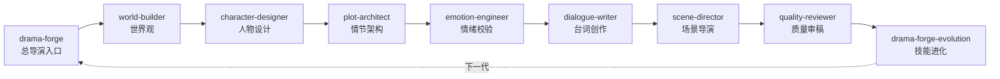
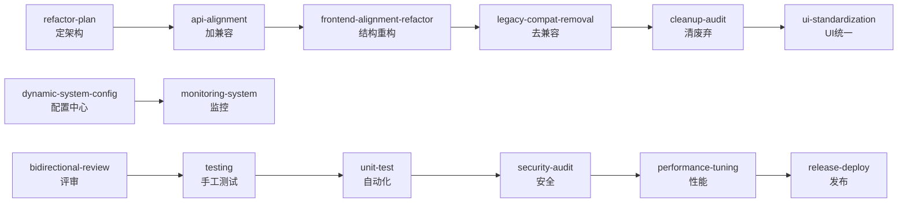

# 项目技能索引

本目录为 **flickplay / ScriptForge** 前后端分离项目的 Cursor Agent 技能库。  
技术栈：Django + DRF 后端，React + TailwindCSS 前端。

> 使用方式：在对话中 `@技能名` 引用，例如 `@fullstack-testing 编写用户列表测试用例`。

---

## 技能全景（16 项）

### 短剧创作类（新增）

| 技能名 | 职责 | 典型触发词 | 平台 |
|--------|------|------------|------|
| [drama-forge](drama-forge/SKILL.md) | AI短剧剧本创作多角色协作套件（总导演/世界观/人物/情节/台词/镜头/情绪/审稿） | 短剧创作、帮我写、编剧、剧本 | Cursor·Codex·Trae |
| [drama-forge-evolution](drama-forge-evolution/SKILL.md) | drama-forge 技能自我进化协议（收集评分→分析缺陷→更新技能→PR合并） | 进化分析、技能优化、复盘改进 | Cursor·Codex·Trae |

### 工程类（14 项）

| 技能名 | 职责 | 典型触发词 |
|--------|------|------------|
| [fullstack-refactor-plan](fullstack-refactor-plan/SKILL.md) | 架构重构落地方案、分层规范 | 重构方案、目录规范、服务层抽取 |
| [fullstack-api-alignment](fullstack-api-alignment/SKILL.md) | 前端 v1.0 对齐新版后端（加兼容层） | 接口对齐、分页适配、响应体兼容 |
| [fullstack-frontend-alignment-refactor](fullstack-frontend-alignment-refactor/SKILL.md) | 前端结构性重构 + 后端对齐 | api 层重组、hooks 清理、adapter 迁移 |
| [fullstack-legacy-compat-removal](fullstack-legacy-compat-removal/SKILL.md) | 删除过渡兼容，仅保留新版契约 | 去 legacy、删双版本 adapter |
| [fullstack-cleanup-audit](fullstack-cleanup-audit/SKILL.md) | 废弃文件/目录清理审计 | 死代码、目录重组、命名规范 |
| [fullstack-ui-standardization](fullstack-ui-standardization/SKILL.md) | 全站 UI 规范化（纯样式） | 设计 tokens、视觉统一 |
| [fullstack-bidirectional-review](fullstack-bidirectional-review/SKILL.md) | 前后端双向代码评审 | 页面评审、逻辑审查 |
| [fullstack-monitoring-system](fullstack-monitoring-system/SKILL.md) | 自研监控体系 | 埋点、慢 SQL、告警看板 |
| [dynamic-system-config](dynamic-system-config/SKILL.md) | 动态配置中心 | 配置后台、硬编码迁移 |
| [fullstack-testing](fullstack-testing/SKILL.md) | 手工测试用例、回归、缺陷单、准入 | 测试用例、回归方案、上线检查 |
| [fullstack-unit-test](fullstack-unit-test/SKILL.md) | 自动化单元/API/组件测试代码 | 补单测、manage.py test、Vitest |
| [fullstack-security-audit](fullstack-security-audit/SKILL.md) | 安全专项审计 | 越权排查、XSS、发布前安全自查 |
| [fullstack-release-deploy](fullstack-release-deploy/SKILL.md) | 发布部署与回滚 | docker-compose、迁移、灰度、回滚 |
| [fullstack-performance-tuning](fullstack-performance-tuning/SKILL.md) | 性能诊断与优化实施 | 慢接口、N+1、卡顿、压测、缓存 |

---

## 迭代生命周期推荐顺序

### 短剧创作链路



### 工程开发链路



实际可并行或跳过阶段，按迭代目标选取。

---

## 技能边界矩阵

| 场景 | 首选技能 | 勿用 |
|------|----------|------|
| 加旧版兼容分支 | api-alignment | legacy-compat-removal |
| 删旧版兼容分支 | legacy-compat-removal | api-alignment |
| 只改样式 | ui-standardization | api-alignment |
| 删文件不改接口 | cleanup-audit | legacy-compat-removal |
| 写手工测试用例/回归表 | testing | unit-test |
| 写自动化测试代码 | unit-test | testing |
| 代码质量评审 | bidirectional-review | testing |
| 安全专项检查 | security-audit | testing（仅基础场景） |
| 上线 docker/迁移 | release-deploy | refactor-plan |
| 慢接口/N+1/卡顿优化 | performance-tuning | testing（仅基础分析） |
| 采集慢 SQL/看板 | monitoring-system | performance-tuning（观测≠优化） |

---

## 统一文档结构

每个技能目录：

```
skill-name/
├── SKILL.md       # 主指令（含中文 description）
├── REFERENCE.md   # 详细模板与检查清单
└── examples.md    # 可选，输出示例

drama-forge/       # 短剧创作套件（额外结构）
├── SKILL.md       # 主入口（多平台兼容头）
├── REFERENCE.md   # 知识资产汇总
└── roles/         # 各角色详细规范
    ├── drama-director.md
    ├── world-builder.md
    ├── character-designer.md
    ├── plot-architect.md
    ├── dialogue-writer.md
    ├── scene-director.md
    ├── emotion-engineer.md
    ├── quality-reviewer.md
    └── evolution-analyst.md
```

`SKILL.md` 推荐章节顺序：

1. 项目基础信息
2. 适用场景（含与其他技能分工）
3. 工作原则 / 硬性约束
4. 工作流程
5. 输出要求 / 维度速查
6. 分析前置步骤
7. 详细参考 → REFERENCE.md

---

## 已补齐项（本轮）

- [x] `fullstack-legacy-compat-removal` 同步至 ScriptForge
- [x] `dynamic-system-config` 同步至 flickplay 根目录
- [x] 各技能 `description` 中文化
- [x] 章节名统一为「项目基础信息」
- [x] `fullstack-testing/examples.md` 输出样例
- [x] 新增 `fullstack-security-audit`、`fullstack-release-deploy`
- [x] 新增 `fullstack-performance-tuning`
- [x] 新增 `fullstack-unit-test`
- [x] 新增 `drama-forge` — AI短剧创作多角色协作技能套件（Cursor·Codex·Trae 三平台兼容）
- [x] 新增 `drama-forge-evolution` — 自我进化元技能（Git-Native 进化协议）
- [x] 新增 `.codex/drama-forge.md`（Codex CLI 适配器）
- [x] 新增 `.trae/rules/drama-forge.md`（Trae IDE 适配器）

---

## 后续可规划技能（暂未实现）

| 建议技能 | 理由 | 当前替代 |
|----------|------|----------|
| `fullstack-openapi-sync` | OpenAPI/接口文档与代码双向同步 | api-alignment 含契约审计 |

如需上述技能，可按现有模板扩展。

---

## 关联 Rules

- `ScriptForge/.cursor/rules/project-core-standards.mdc`
- `ScriptForge/.cursor/rules/django-backend-standards.mdc`
- `ScriptForge/.cursor/rules/frontend-ui-standards.mdc`
- `ScriptForge/.cursor/rules/frontend-api-contracts.mdc`
- `ScriptForge/.cursor/rules/security-testing-standards.mdc`
