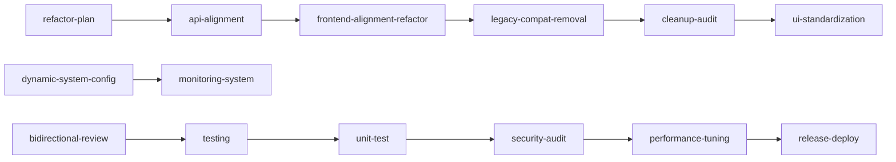

# ScriptForge 技能索引

本目录为 **ScriptForge** 项目的 Cursor Agent **工程技能库**（fullstack-*）。  
短剧创作技能已迁移至 `drama-skills/` 目录（根目录下），不再维护此处。

> 短剧创作技能：`/workspace/drama-skills/` — 36个专业角色，使用方式见 `drama-skills/README.md`

---

## 工程技能（14 项）

| 技能名 | 职责 | 典型触发词 |
|--------|------|------------|
| [fullstack-refactor-plan](fullstack-refactor-plan/SKILL.md) | 架构重构落地方案、分层规范 | 重构方案、目录规范、服务层抽取 |
| [fullstack-api-alignment](fullstack-api-alignment/SKILL.md) | 前端 v1.0 对齐新版后端（加兼容层） | 接口对齐、分页适配、响应体兼容 |
| [fullstack-frontend-alignment-refactor](fullstack-frontend-alignment-refactor/SKILL.md) | 前端结构性重构 + 后端对齐 | api 层重组、hooks 清理、adapter 迁移 |
| [fullstack-legacy-compat-removal](fullstack-legacy-compat-removal/SKILL.md) | 删除过渡兼容，仅保留新版契约 | 去 legacy、删双版本 adapter |
| [fullstack-cleanup-audit](fullstack-cleanup-audit/SKILL.md) | 废弃文件/目录清理审计 | 死代码、目录重组、命名规范 |
| [fullstack-ui-standardization](fullstack-ui-standardization/SKILL.md) | 全站 UI 规范化（纯样式） | 设计 tokens、视觉统一 |
| [fullstack-bidirectional-review](fullstack-bidirectional-review/SKILL.md) | 前后端双向代码评审 | 页面评审、逻辑审查 |
| [fullstack-monitoring-system](fullstack-monitoring-system/SKILL.md) | 自研监控体系 | 埋点、慢 SQL、告警看板 |
| [dynamic-system-config](dynamic-system-config/SKILL.md) | 动态配置中心 | 配置后台、硬编码迁移 |
| [fullstack-testing](fullstack-testing/SKILL.md) | 手工测试用例、回归、缺陷单、准入 | 测试用例、回归方案、上线检查 |
| [fullstack-unit-test](fullstack-unit-test/SKILL.md) | 自动化单元/API/组件测试代码 | 补单测、manage.py test、Vitest |
| [fullstack-security-audit](fullstack-security-audit/SKILL.md) | 安全专项审计 | 越权排查、XSS、发布前安全自查 |
| [fullstack-release-deploy](fullstack-release-deploy/SKILL.md) | 发布部署与回滚 | docker-compose、迁移、灰度、回滚 |
| [fullstack-performance-tuning](fullstack-performance-tuning/SKILL.md) | 性能诊断与优化实施 | 慢接口、N+1、卡顿、压测、缓存 |

---

## 工程技能迭代链路

---

## 关联规范

- `ScriptForge/.cursor/rules/project-core-standards.mdc`
- `ScriptForge/.cursor/rules/django-backend-standards.mdc`
- `ScriptForge/.cursor/rules/frontend-ui-standards.mdc`
- `ScriptForge/.cursor/rules/security-testing-standards.mdc`
