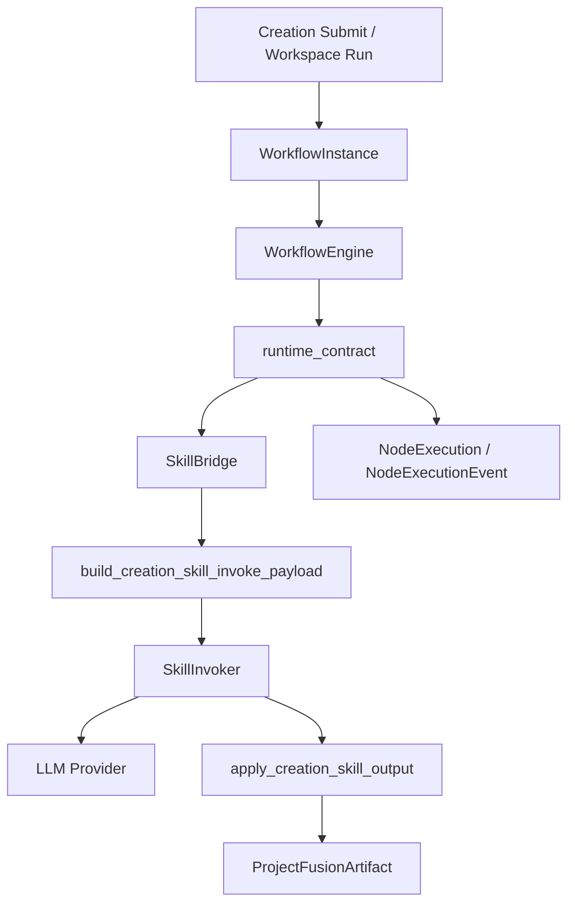

# Core Chain Refactor Plan

> **状态（2026-06-18）**：C 端主链路已切换为 **Project + 独立 Agent + DB 化**；`node_index` 旧工作台接口返回 410。本文档中 WorkflowEngine / demo4book 相关描述为历史重构背景，非当前运行路径。

日期：2026-06-17

## 结论

当前链路的问题不是单个 agent 写得不够好，而是系统把太多职责塞进黑盒式 agent 链：

- 一个 agent 同时承担 prompt 组织、业务判断、校验、落库、计费、追踪。
- 输入上下文在节点间反复膨胀，snake/camel 双份字段进一步放大 token。
- demo4book、ai-drama-skills-v2、ScriptForge 三套资产同时存在，但没有清晰运行边界。
- 调试入口分散：WorkflowEngine、SkillBridge、workspace agent、旧 orchestration、CLI validator 都可能被调用。

重构目标：把系统收敛成一个可观察、可预算、可单步复盘的执行内核。Agent 只做创作或判断，不再隐式承担调度、预算、落库和追踪。

## 目标架构

## 第一阶段：已开始实施

本阶段不新增数据库迁移，只补运行期内核：

- `workflow/runtime_contract.py`：统一输入快照、payload 体积预算、上下文压缩、事件记录。
- `WorkflowEngine`：启动时写入 project seed context；每个节点记录 input snapshot；失败节点明确写 `NodeExecution.failed`；节点成功后压缩上下文。
- `SkillBridge`：`creation.*` 节点统一走 `build_creation_skill_invoke_payload()`，成功后统一走 `apply_creation_skill_output()` 落 artifact。
- `AgentRegistry`：恢复 `get_agent_registry.cache_clear()` 兼容口，避免后台和测试因 TTL 缓存改造断裂。
- `WorkflowLaunchViewSet`：修复入口传参，按当前用户加载 `Project` 对象。
- `creation.tasks`：修复 `NodeExecution.STATUS_COMPLETED` 错误常量，改用 `STATUS_SUCCEEDED`。

验收标准：

- 任意节点失败时能定位到 `WorkflowInstance`、`NodeExecution`、`NodeExecutionEvent`。
- 每个节点能看到输入 keys、字节数、估算 token、输出 artifact。
- 超大 payload 在进入 LLM 前阻断，而不是烧 token 后失败。
- `creation.brief` 首节点能拿到项目的 `theme/core_idea/episode_count` 等真实输入。

## 第二阶段：压缩主链

把主链从“多 agent 多子技能”压成 5 个稳定业务节点：

1. `creation.brief`：项目 brief，只做输入归一和创作约束。
2. `creation.structure`：世界观、结构、节奏，输出 `structure_plan`。
3. `creation.character`：角色库，输出 `character_bible`。
4. `creation.outline`：分集大纲，支持批次生成。
5. `creation.script`：剧本正文，支持批次生成。

质检、评分、营销不进入主链阻塞用户创作：

- `creation.review`：作为显式后处理或用户主动触发。
- `creation.score`：作为可发布判定。
- `creation.polish`：只消费 review 报告，不自动无限循环。
- `creation.marketing`：导出/宣发阶段使用。

## 第三阶段：旁支资产处理

### demo4book

保留并吸收：

- `schemas/`：作为 JSONSchema 的源资产，导入 DB 后由 DB 作为运行 SSOT。
- `templates/`：作为展示/导出模板候选。
- `runtime/sub-*`：只保留确定性校验器，不能再作为主链编排器。

删除或归档：

- 重复的主链脚本。
- 需要通过 CLI 串起整条链的运行方式。

结论：demo4book 是“标准资产库”，不再是运行时主控。

### ai-drama-skills-v2

吸收：

- `config/*.json`：合规、市场、情绪、评分阈值等规则库。
- `templates/*.md`：可用于系统提示词或导出模板。
- 高质量 SKILL.md 中的行业规则，拆成 DB-backed `AgentSkillDefinition.system_hint` 和 `SkillRuleConfig`。

归档：

- 各子 skill 目录中重复的 orchestration 指南。
- `scripts/*` 中和 ScriptForge 已有 validators 重叠的部分。
- 测试输出、历史 archive 文档。

结论：ai-drama-skills-v2 是“规则素材库”，不再是第二套技能运行时。

## 第四阶段：可调试工具

可调试入口按“先追踪、再 dry-run、最后单技能 payload”推进：

- 已补齐 `workflow_trace <instance_id|--project-id>`：打印实例、节点、事件、LLM 用量、输入快照、输出摘要；支持 `--json`。
- 待补齐 `workflow_dry_run <project_id|pack_id>`：不调 LLM，只看计划和 payload 预算。
- 待补齐 `skill_payload <project_id> <skill_id>`：打印某技能真实入参摘要，可选导出完整 JSON。

## 保留原则

- 调度只在 `WorkflowEngine`。
- 技能调用只在 `SkillBridge`。
- LLM 调用只在 `SkillInvoker/LlmService`。
- 节点输入只由 `build_creation_skill_invoke_payload` 构造。
- 节点输出只由 `apply_creation_skill_output` 落库。
- demo4book 和 ai-drama-skills-v2 只做资产来源，不参与线上运行调度。
