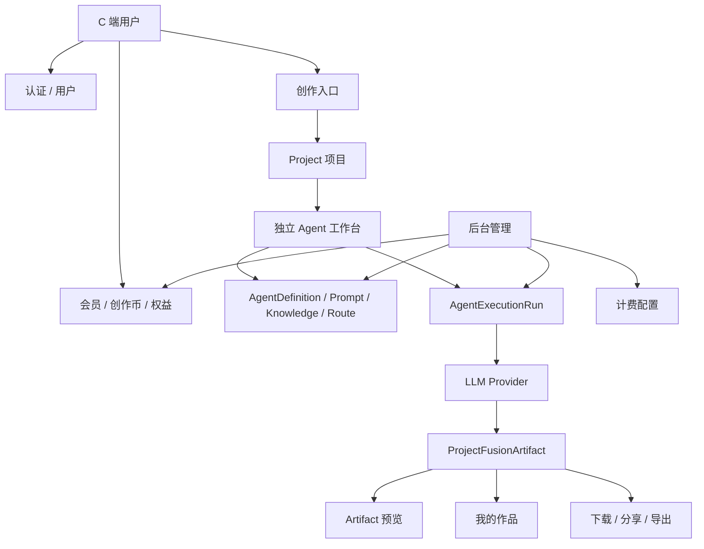
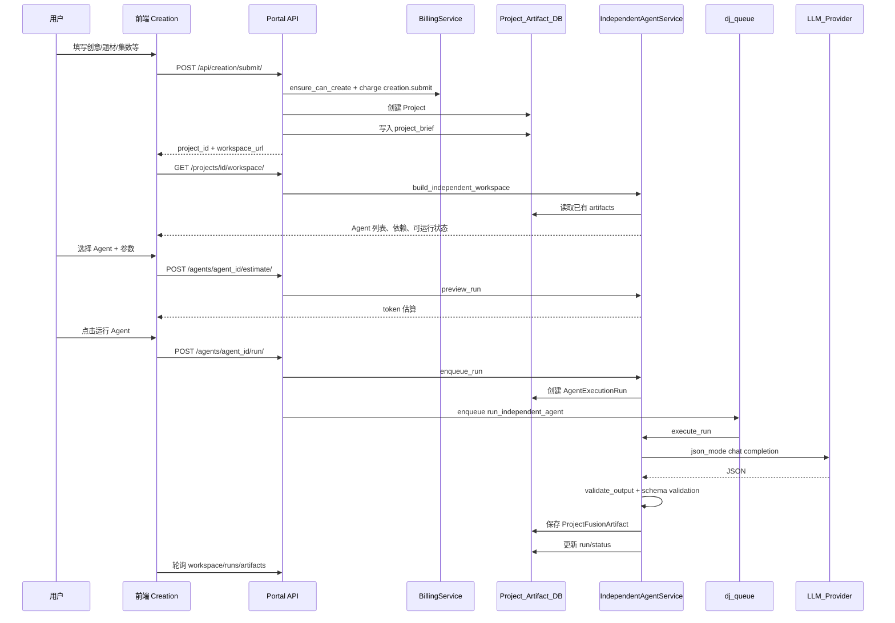
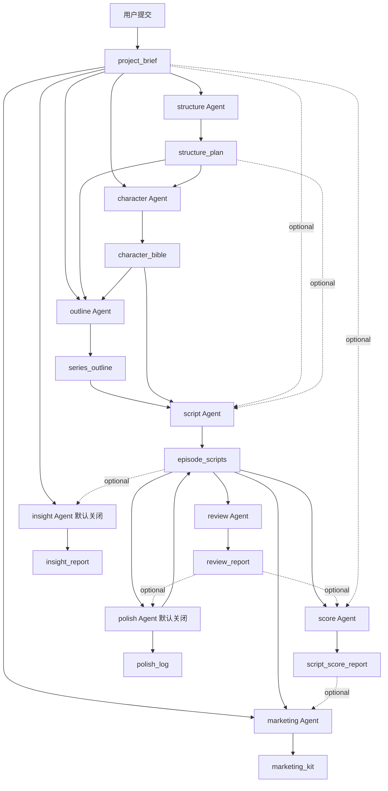
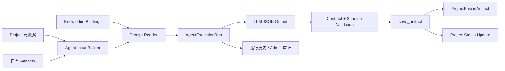

# ScriptForge 创作业务架构

> **文档定位**：描述当前 C 端主链路的业务流程与创作流程架构。旧 7 节点自动流水线仅作 Legacy 背景，不作为当前主路径。
>
> **技术视角**见 [TECH-ARCHITECTURE.md](./TECH-ARCHITECTURE.md)；迁移历史见 [CORE-CHAIN-REFACTOR-PLAN.md](./CORE-CHAIN-REFACTOR-PLAN.md)。

---

## 一、当前业务流程总架构

ScriptForge 当前的业务核心不是「用户提交后系统自动跑完整流水线」，而是：

> 用户提交创意生成项目与初始简报，然后进入独立 Agent 工作台，按创作需要手动运行各个 DB 化 Agent。每个 Agent 读取项目字段和已有 Artifact，调用 LLM，输出新的 Artifact。最终以 `episode_scripts` 为核心进入预览、下载、分享、作品管理。



### 代码入口

| 层级 | 路径 |
|------|------|
| C 端 API 总入口 | `backend/apps/portal/urls.py` |
| 创作 API 路由 | `backend/apps/portal/creation/urls.py` |
| 创作服务门面 | `backend/apps/creation/services/facade.py` |
| 独立 Agent runtime | `backend/apps/creation/agent_runtime/independent_service.py` |
| 工作台聚合 | `backend/apps/creation/agent_runtime/workspace.py` |
| Agent 定义服务 | `backend/apps/agent/definition_service.py` |

---

## 二、业务模块拆解

### 1. 用户与权限域

C 端创作、作品、下载、分享创建接口均要求 `IsAuthenticated`。项目访问通过 `_get_user_project` 做归属校验，确保用户只能操作自己的项目。分享页支持匿名访问，与登录态隔离。

关键入口：`/api/auth/`、`/api/users/`、`/api/creation/...`、`/api/works/...`

### 2. 会员与创作币域

创作提交前经过计费与会员校验：

- `BillingService.ensure_can_create(user)` — 是否具备创作资格
- `MembershipService.get_current_membership(user)` — 记录项目创建时会员状态
- `BillingService.charge(user, "creation.submit", reference_id=project.id)` — 扣除发起创作费用

证据：`backend/apps/creation/services/submission.py`

**注意**：当前独立 Agent 的 `enqueue_run` / `execute_run` **无逐次扣币**；明确扣费点是 `creation.submit`。Legacy 路径中仍有节点级扣币逻辑，非当前主链路核心。

### 3. 创作项目域

`Project` 是业务项目主体。新项目创建时：

- `pipeline_mode = workspace`
- `pipeline_pack = None`
- `status = pending`
- `current_node_index = 0`、`total_nodes = 0`
- 初始写入 `project_brief`（由 submit 直接 seed，非 Agent 运行产物）
- 不自动触发旧 workflow

Project 是「创作容器」，不是旧流水线状态机。

### 4. Agent 定义域

独立 Agent 配置来自数据库：

| 模型 | 职责 |
|------|------|
| `AgentDefinition` | Agent 主体、启用状态、生命周期、契约、运行策略、UI schema |
| `AgentPromptVersion` | Prompt 版本 |
| `AgentKnowledgeItem` | 知识 / 规则 / Schema / 素材 |
| `AgentKnowledgeBinding` | Agent 与知识绑定 |
| `AgentLlmRouteConfig` | 模型路由 |

默认定义由 `AgentDefinitionService.ensure_defaults()` 写入；后台可管理，不依赖外部技能目录。

### 5. Artifact 产物域

创作中间产物统一落在 `ProjectFusionArtifact`。Agent 通过 output contract 声明写入哪些 artifact。

主 artifact：

- `project_brief`、`structure_plan`、`character_bible`、`series_outline`、`episode_scripts`
- `review_report`、`script_score_report`（历史别名 `score_report`）
- `marketing_kit`、`insight_report`、`polish_log`

Artifact 是创作流程的**数据总线**：下游 Agent 从项目已有 Artifact 读取输入，不直接读上游 Agent 内存结果。

### 6. Agent 运行域

每次运行产生 `AgentExecutionRun`，记录 agent_id、prompt_version、输入/输出 artifact keys、input snapshot、run params、token 估算、provider/model、status、error、成本统计等。

Portal 默认隐藏敏感 prompt（`include_sensitive=False`）；Admin 可查看更完整信息。独立 Agent 路径默认不含 `sub_skills` trace（Legacy 编排专用，见 `run_serialization.py`）。

### 7. 作品与交付域

当 `episode_scripts` 存在时，项目具备导出基础：

- `download_script` / `download_by_token`
- `export_work` / `persist_script_works`

证据：`backend/apps/creation/services/share_download.py`、`backend/apps/creation/script_delivery.py`

作品列表与详情：`backend/apps/portal/creation/works_views.py`（`/api/works/`）

### 8. 分享域

分享须基于 **completed** 项目（见下文「完成态判定」）：

- 创建 `ShareLink`，设置 view limit、过期时间、可选 allow_download
- 匿名访问时增加 view count，达上限后失效
- 返回渲染后 HTML，不暴露原始 JSON

证据：`backend/apps/creation/services/share_download.py`

### 9. 后台运营管理域

管理独立 Agent 定义、Prompt、Knowledge、Binding、LLM Route、运行记录，以及会员/计费/订单/用户。Legacy 编排配置仍保留但已标注非 C 端主路径（见 `backend/apps/creation/legacy/README.md`）。

---

## 三、当前创作主流程



### 主链路 API（前缀 `/api/creation/`）

| 方法 | 路径 | 说明 |
|------|------|------|
| POST | `submit/` | 提交创作 |
| GET | `projects/<project_id>/workspace/` | 独立 Agent 工作台 |
| POST | `projects/<project_id>/agents/<agent_id>/estimate/` | Token 预估 |
| POST | `projects/<project_id>/agents/<agent_id>/run/` | 触发运行 |
| GET | `projects/<project_id>/agents/<agent_id>/runs/` | 运行历史 |
| GET | `projects/<project_id>/runs/<run_id>/` | 运行详情 |
| GET | `projects/<project_id>/artifacts/<artifact_key>/` | Artifact 预览 |
| GET | `download/<project_id>/` | 下载（md/html/zip/pdf） |
| POST | `share/<project_id>/` | 创建分享 |
| GET | `share/view/<token>/` | 匿名查看分享 |

---

## 四、创作流程分阶段详解

### 阶段 0：创作前置条件

用户须满足：已登录、会员/账户允许创作、创作币足够支付 `creation.submit`；后台须有可用 Agent 定义、active prompt、可用 LLM route，且 input/output contract 完整。

Agent 健康由 `AgentDefinitionService.health()` 计算：`prompt_ok`、`route_ok`、`contract_ok`、`healthy`。

### 阶段 1：提交创作

`POST /api/creation/submit/`

1. 校验请求参数
2. `BillingService.ensure_can_create(user)`
3. 读取当前会员
4. 创建 `Project`
5. 扣 `creation.submit`
6. `build_project_brief` + `save_artifact(project, "project_brief", ...)`
7. 返回 `project_id` 与 `workspace_url`

**业务意义**：提交不是「开始自动生成全集」，而是「创建创作空间并 seed 第一个基础产物」。此时 `project_brief` 已存在，用户可直接运行依赖它的下游 Agent。

### 阶段 2：进入独立 Agent 工作台

`GET /api/creation/projects/<project_id>/workspace/`

`build_independent_workspace(project)` 返回：项目信息、已有 artifact 列表、active Agent 列表、required/missing inputs、output artifacts、latest run、`can_run`、token policy、ui_schema、health。

`can_run` 核心判断：

```text
required_artifacts 无缺失 且 health.healthy = true
```

这是当前创作链路的**软编排**：不由系统硬编码下一步，而由 artifact 依赖决定哪个 Agent 可运行。

### 阶段 3：Agent 依赖图



**推荐运行顺序**（submit 已 seed `project_brief`，故从 structure 起）：

1. `structure` → `character` → `outline` → `script` → `review` → `score` → `marketing`

`brief` Agent 为**可选重跑/增强**简报，非必经步骤。系统不强制自动串行；是否可运行由缺失 artifact 与 Agent health 决定。

默认 C 端不可见：`insight`、`polish`（`AGENT_DEFAULTS` 中 `enabled: False`），除非后台启用。

### 阶段 4：运行前 Token 估算

`POST /api/creation/projects/<project_id>/agents/<agent_id>/estimate/`

构建输入、加载 Knowledge、渲染 prompt、粗估 prompt tokens，返回是否超过 `max_prompt_tokens`。估算非精确 tokenizer，用于前端提前阻止明显超限请求。

### 阶段 5：触发 Agent 运行

`POST /api/creation/projects/<project_id>/agents/<agent_id>/run/`

`enqueue_run()` 关键控制：

1. 校验项目归属
2. `select_for_update` 锁定 Project
3. 检查是否已有 running run；超过 2 小时的 running 自动标 failed
4. 获取可运行 Agent，构建输入，渲染 prompt，检查 token limit
5. 创建 `AgentExecutionRun`，项目 `status=running`
6. on commit 后投递 `run_independent_agent`

**同一项目同一时间仅允许一个 Agent 运行。**

### 阶段 6：Agent 输入构建

`build_agent_input()` 按 input contract 读取项目字段、required/optional artifacts、params。required artifact 缺失则直接报错，不进入 LLM。

### 阶段 7：Knowledge 注入

`load_knowledge()` 读取启用的 Binding 与 KnowledgeItem，按顺序加载，支持 max_chars 截断；`validator` 类型 binding 不作为普通上下文注入。

### 阶段 8：Prompt 渲染

模板包含 agent 信息、project 字段、artifacts、knowledge、params、output format、constraints。要求输出 JSON。运行记录保存 `prompt_version` 供追溯。

### 阶段 9：LLM 调用与校验

`execute_run()` 使用 JSON mode，随后：

1. `extract_json_object()` 提取 JSON
2. `validate_output()` 校验顶层 artifact contract
3. `output_schema_validation.validate_matched_outputs()` 字段级校验
4. 通过后保存 artifact；失败则 run failed

### 阶段 10：Artifact 写入策略

`persist_agent_output()` 按 overwrite mode：

- `replace`：替换 artifact body
- `merge`：episode 型按集数合并（script Agent 分批 1–3 集）
- `polish_log`：追加 suggestions

每个 artifact 写入 `_meta`：agentId、runId、promptVersion、generatedAt、schemaVersion、overwriteMode。

### 阶段 11：项目状态更新

`update_project_status()`：

- 存在 running run → `running`
- 存在 `episode_scripts` artifact（不论集数是否写满）→ `completed`
- 否则 → `pending`

**完成态不以「所有 Agent 跑完」或「集数对齐 episode_count」为准**，而以是否已有脚本正文产物为核心。

### 阶段 12：前端轮询与预览

工作台在 project locked 时约每 3 秒刷新 workspace，拉取 run history 与 artifact preview。

| 类型 | 预览方式 |
|------|----------|
| brief / structure / character / outline / script | 结构化只读 Skill 编辑器视图 |
| review_report / script_score_report / marketing_kit / insight_report / polish_log | 专用报告面板 |

后端：`build_artifact_editor_view()`；前端：`ArtifactPreviewPanel.jsx` + `reports/*Panel.jsx`。

### 阶段 13：下载与导出

`GET /api/creation/download/<project_id>/?format=md|html|zip|pdf`

或作品页 `GET /api/works/<project_id>/export/?format=md`

从 artifact 渲染面向用户的文件；有 `ScriptWork` 文件时优先读文件，否则即时导出。

### 阶段 14：分享

`POST /api/creation/share/<project_id>/` 或 `POST /api/works/<project_id>/share/`

须 `status=completed`；创建 ShareLink、token、过期与 view limit；匿名 `GET /api/creation/share/view/<token>/` 递增 view_count 并返回渲染 HTML。

---

## 五、Agent 工作台业务规则

### 1. Agent 是否显示

仅 `lifecycle_status=active` 且 `is_enabled=True`。默认 `insight`、`polish` 不在 C 端列表，除非后台启用。

### 2. Agent 是否可运行

须同时满足：required artifacts 存在且非空、active prompt、active route、route 绑定可用 provider、contract 完整。

### 3. 并发控制

同一 Project 不允许多 Agent 同时 running；前端 `projectLocked` 阻止重复提交。

### 4. 输出可信度

两层校验：artifact key 须在 output contract 内；关键字段须满足 schema validator（`output_schema_validation.py`）。

### 5. 可追溯性

可追溯到用户、项目、Agent、prompt version、provider/model、输入/输出 artifact keys、token 与 cost、error、artifact `_meta`。

---

## 六、创作数据流架构

三条数据线：



1. **项目元数据线** — `Project.theme/core_idea/episode_count/...`
2. **Artifact 产物线** — `ProjectFusionArtifact.artifact_key + payload`
3. **Run 追踪线** — `AgentExecutionRun`

---

## 七、旧架构在当前业务中的位置

Legacy 执行代码与历史表**均已删除**（迁移 `creation.0020` / `workflow.0013`）：

- 已删代码：`orchestration/`、`step_mode`、`run_creation_pipeline`、`workspace_service` 旧链
- 已删表：`CreationNode`、`SubSkillExecutionLog`、`CreationTask`、`BatchJob`、`WorkflowInstance`、`NodeExecution`
- 已 stub：`WorkflowEngine`（实例化抛错）

勿在新功能中接入旧 7 节点自动流水线。

---

## 八、当前业务架构的核心特点

1. **自动流水线 → 人工可控工作台**：用户决定运行顺序、重跑时机、是否进入 review/score/marketing。
2. **硬编码技能 → DB 化 Agent**：prompt、knowledge、route、contract 可后台管理。
3. **节点状态驱动 → Artifact 依赖驱动**：下游可运行性取决于上游 artifact 是否存在。
4. **一次性生成 → 分批合并可追溯**：script/polish 支持分集 merge 与 `_meta` 追溯。
5. **原始 JSON 暴露 → 结构化预览 + 导出渲染**：C 端 preview 走 editor_view/报告面板；下载分享走渲染文档。

---

## 九、完整创作业务闭环

```text
登录用户
  -> 会员/创作币校验
  -> 提交创意（creation.submit 扣费）
  -> 创建 Project + seed project_brief
  -> 进入独立 Agent 工作台
  -> 按 artifact 依赖手动运行 Agent（推荐从 structure 起）
  -> LLM 输出 JSON
  -> 契约与字段校验
  -> 写入 ProjectFusionArtifact
  -> 前端预览 artifact
  -> episode_scripts 出现后项目可交付（completed）
  -> 下载 / 分享 / 我的作品
  -> 后台追踪 Agent 定义、Prompt、Knowledge、Route、运行记录
```

**一句话**：Project 是容器，Artifact 是数据总线，AgentExecutionRun 是审计轨迹，AgentDefinition/Prompt/Knowledge/Route 是可配置生产力中心，下载分享是交付层。

---

## 十、Legacy 已下线（2026-06）

自本迭代起，以下能力已从生产路径移除（路由 404 或 Admin 不可达）：

| 已下线 | 替代 |
|--------|------|
| `run_creation_pipeline` / WorkflowEngine | 独立 Agent 工作台 `run_independent_agent` |
| Portal `confirm` / `regenerate` / `nodes/*/preview` | 工作台手动运行 Agent |
| Works `POST .../agents/.../run/` | 仅创作工作台可跑 Agent |
| Admin orchestration / main-chain / workflow API | `GET /api/admin/agent/runs/` 运行监察 |
| batch 批量创作 | 已删除 |

Legacy 表 `CreationNode` / `WorkflowInstance` / `CreationTask` / `SubSkillExecutionLog` / `BatchJob` 已通过迁移物理删除。
