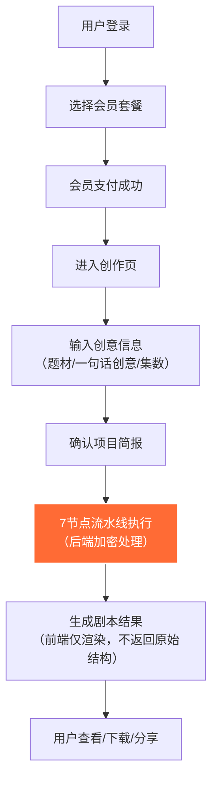
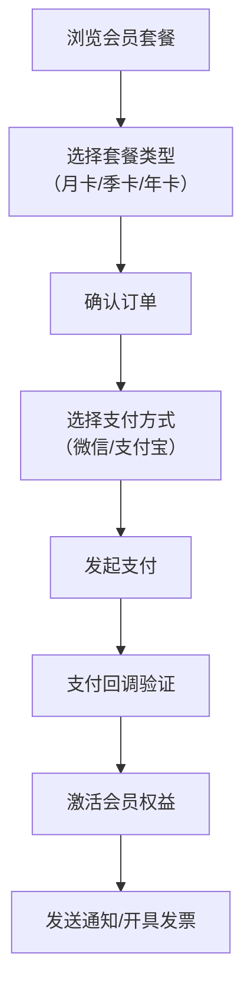

# 短剧剧本创作平台 PRD (产品需求文档)

> **项目代号**: ScriptForge AI  
> **版本**: v1.0.0  
> **创建日期**: 2026-06-10

---

## 1. 产品概述

**一句话描述**: 基于AI的专业短剧剧本创作平台，将一句话创意快速转化为80集+可拍摄的A级剧本体系。

**核心价值**:
- 为短剧制作团队/独立创作者提供标准化、高质量的剧本创作工具
- 降低短剧创作门槛，提升内容生产效率
- 会员制商业化，按创作次数或订阅付费

**目标用户**:
- 短剧制作公司、MCN机构
- 独立编剧、网文作者
- 影视学院师生
- 短视频内容创作者

---

## 2. 核心功能

### 2.1 用户角色

| 角色 | 注册方式 | 核心权限 |
|------|---------|----------|
| 游客 | 无需注册 | 浏览平台介绍、查看示例剧本片段 |
| 免费用户 | 手机号/邮箱注册 | 免费体验创作1次（最多20集大纲），浏览个人作品 |
| 付费用户 | 注册后购买会员 | 完整剧本创作，下载多格式输出，优先队列 |
| VIP会员 | 订阅月/季/年卡 | 无限次创作，所有高级功能，专属客服 |
| 企业用户 | 定制套餐 | 团队协作，API接入，私有模板，独立部署 |
| 管理员 | 后台管理 | 用户管理、订单管理、技能配置、数据统计 |

### 2.2 功能模块总览

1. **用户系统**: 注册登录、个人中心、消息通知
2. **会员系统**: 套餐展示、购买、权益管理、会员卡密
3. **创作系统**: 创意输入 → 7节点流水线 → 剧本输出 → 历史记录
4. **支付系统**: 微信/支付宝支付、订单管理、发票申请
5. **后台管理**: 用户管理、会员管理、技能配置、模板管理、数据看板
6. **安全系统**: 技能加密、接口限流、防爬机制、操作审计

### 2.3 页面详情

| 页面名称 | 模块名称 | 功能描述 |
|---------|---------|----------|
| 首页 (Landing) | Hero区 | 大标题+副标题+CTA按钮，动态背景效果 |
| 首页 | 功能展示 | 4大核心功能卡片（智能创作/多题材覆盖/格式标准/质量审查） |
| 首页 | 创作流程 | 7节点创作流水线可视化展示 |
| 首页 | 用户评价 | 滚动展示用户好评、合作机构Logo墙 |
| 首页 | 定价区 | 3档会员套餐对比展示 |
| 首页 | FAQ | 常见问题折叠面板 |
| 登录/注册 | 身份验证 | 手机号/邮箱+验证码/密码登录，第三方登录可选 |
| 会员中心 | 套餐选购 | 套餐列表、权益对比、购买入口 |
| 会员中心 | 我的订单 | 订单列表、订单详情、支付状态、发票申请 |
| 会员中心 | 卡密兑换 | 输入卡密激活会员 |
| 创作页 | 创意输入 | 题材选择、创意描述、集数设置、高级参数 |
| 创作页 | 进度追踪 | 7节点进度条、实时状态更新、节点详情预览 |
| 创作页 | 结果展示 | 剧本分段展示、格式切换、下载按钮 |
| 我的作品 | 作品列表 | 历史作品卡片、筛选/搜索、继续创作 |
| 我的作品 | 作品详情 | 完整剧本查看、版本对比、分享链接 |
| 个人中心 | 资料管理 | 头像、昵称、联系方式修改 |
| 个人中心 | 安全设置 | 修改密码、绑定手机、登录设备管理 |
| 后台管理 - 仪表盘 | 数据概览 | 核心指标图表（用户数、订单数、营收、创作数） |
| 后台管理 - 用户管理 | 用户列表 | 用户搜索、编辑、冻结、会员状态管理 |
| 后台管理 - 会员管理 | 套餐配置 | 套餐CRUD、权益配置、价格调整 |
| 后台管理 - 技能配置 | 技能管理 | 技能参数调整、题材模板配置、参考资料更新 |
| 后台管理 - 订单管理 | 订单列表 | 订单搜索、状态管理、退款处理 |
| 后台管理 - 数据统计 | 报表中心 | 营收报表、用户画像、创作数据分析 |
| 后台管理 - 系统设置 | 系统配置 | 支付参数、通知模板、安全策略 |

---

## 3. 核心流程

### 3.1 用户创作流程

### 3.2 会员购买流程

---

## 4. 用户界面设计

### 4.1 设计风格

**整体风格**: 高端、专业、科技感、极简主义

| 设计元素 | 规格 |
|----------|------|
| **主色调** | 深海军蓝 `#0A1628`（主背景）、金色 `#D4AF37`（强调色） |
| **辅助色** | 深灰 `#1A1F2E`、中灰 `#2D3748`、文字白 `#F7FAFC` |
| **渐变主色** | `linear-gradient(135deg, #667eea 0%, #764ba2 100%)` |
| **渐变金色** | `linear-gradient(135deg, #f6d365 0%, #fda085 100%)` |
| **按钮风格** | 圆角 `8px`、悬停微放大、渐变背景 + 发光阴影 |
| **卡片风格** | 毛玻璃效果 `backdrop-filter: blur(20px)`、半透明背景、柔和阴影 |
| **字体** | 中文: PingFang SC / 思源黑体；英文: Inter；标题加粗，正文轻盈 |
| **字号** | H1: 48px, H2: 36px, H3: 24px, 正文: 16px, 辅助: 14px |
| **布局** | 卡片式布局 + 网格系统，大量留白，层次感强 |
| **图标** | 线性图标 + 彩色渐变填充，统一1.5px线条 |
| **动效** | 微交互: 悬停缩放/颜色过渡；入场动画: fadeInUp/scaleIn；页面切换平滑过渡 |

### 4.2 页面设计概览

| 页面名称 | 模块名称 | UI 设计要点 |
|---------|---------|------------|
| **首页** | Hero区 | 全屏背景（深色渐变+动态粒子），中央大标题（渐变金色），双CTA按钮（立即体验/观看演示），下方有向下滚动提示动画 |
| 首页 | 功能展示 | 4张卡片横向排列（毛玻璃+渐变边框），图标悬浮动效，Hover后卡片上浮+阴影加深 |
| 首页 | 创作流程 | 7节点时间线，连接线有流动光效，节点图标动画点亮 |
| 首页 | 用户评价 | 横向滚动卡片轮播，用户头像+名称+评价内容+评分星级 |
| 首页 | 定价区 | 3列套餐对比，VIP套餐居中并突出（金色边框+推荐标签），价格大字醒目 |
| **创作页** | 输入区 | 左侧题材选择（卡片网格），右侧表单输入（大文本框+字数统计），集数滑块调整 |
| 创作页 | 进度区 | 顶部7节点进度条（高亮当前节点），下方实时状态卡片（节点名称+预估时间+小动画） |
| 创作页 | 结果区 | Tab切换（大纲/剧本/人物圣经/质量报告），内容区可折叠，下载按钮组 |
| **会员中心** | 套餐区 | 卡片纵向展示，VIP卡片突出，权益列表使用勾选图标，立即购买按钮渐变色 |
| **后台管理** | 仪表盘 | 4个指标卡片（用户数/订单数/营收/创作数），下方折线图/饼图/柱状图组合 |

### 4.3 响应式设计

- **主断点**: 1200px（桌面）、768px（平板）、480px（手机）
- **设计策略**: Desktop-first，向下适配
- **移动端优化**: 横向滚动改纵向堆叠，导航改为汉堡菜单，触摸按钮最小44px，简化首页内容密度

---

## 5. 安全设计（核心要求）

### 5.1 技能安全策略

| 策略 | 实现方式 |
|------|---------|
| **零数据结构返回** | 前端接收的所有创作结果均为**预渲染的HTML片段**或**加密的二进制流**，绝不返回原始JSON/数据结构 |
| **后端加密处理** | 技能调用在隔离环境执行，输入参数签名校验，输出结果一次性Token绑定 |
| **技能配置隔离** | 技能模板/参考资料存储在独立加密存储，仅后台可更新，前端不可直接访问 |
| **防逆向工程** | 前端代码混淆 + 动态代码加载，关键API签名算法在WebAssembly中执行 |
| **请求签名** | 每个API请求包含时间戳+Nonce+签名，防止重放攻击和篡改 |
| **接口限流** | 按用户ID+IP双重限流，创作接口特别限频，异常流量自动告警 |
| **操作审计** | 所有创作行为完整日志，包含用户IP、设备指纹、请求参数快照 |
| **结果水印** | 下载的剧本文件含不可见数字水印，可追溯来源 |

### 5.2 数据安全

- 用户密码使用 PBKDF2 + 随机盐 哈希存储
- 支付数据通过PCI-DSS合规的第三方支付网关，本地不存储卡号
- 敏感操作（修改密码/提现/大额支付）需二次验证
- 数据库敏感字段（手机号、邮箱）加密存储

---

## 6. 附加功能建议

| 功能名称 | 价值描述 | 优先级 |
|---------|---------|-------|
| **剧本分享** | 生成带水印的剧本分享链接，访问统计 | P1 |
| **团队协作** | 企业用户支持多人协同编辑、评论、版本管理 | P1 |
| **API开放平台** | 企业客户通过API调用创作能力，接入自有系统 | P2 |
| **模板市场** | 用户可上传/购买优秀剧本模板，分成机制 | P2 |
| **剧本评分** | 对生成的剧本进行AI评分 + 社区打分 | P2 |
| **小说转剧本** | 上传小说文本，自动转换为短剧剧本格式 | P2 |
| **剧本导出优化** | 支持导出为Word/PDF/Fountain/FDX等专业格式 | P2 |
| **创作历史版本** | 自动保存每次创作的版本，可回滚对比 | P3 |
| **智能续写** | 基于已有剧本续写新集数，或修改特定段落 | P3 |
| **多语言支持** | 英文/日文/韩文界面，出海题材模板 | P3 |
| **数据大屏** | 后台数据可视化大屏，实时监控平台运营状态 | P3 |

---

## 7. 后台管理核心配置项

### 7.1 技能配置模块

| 配置项 | 说明 |
|--------|------|
| **技能版本** | 当前生效版本号，支持多版本并存，可切换 |
| **题材模板** | 8大题材的参数配置（结构模板、反转密度、情绪曲线系数） |
| **钩子库管理** | 钩子模板CRUD，按类型分类（开场/反转/悬念/金句） |
| **台词模板** | 情绪外化词典、色温对照表、音效库维护 |
| **质量审查规则** | 格式检查正则、评分权重、通过率阈值 |
| **输出格式配置** | 4种剧本格式变体的模板定义（Markdown/行业版/精简/分镜） |
| **AI模型参数** | 温度、top_p、最大token等可调整参数（加密存储） |
| **合规审查规则** | 敏感词库、政策风险检测规则、2026新规检查项 |

### 7.2 会员套餐配置

| 配置项 | 说明 |
|--------|------|
| **套餐名称** | 月卡/季卡/年卡/终身卡 |
| **价格** | 原价、折扣价、展示价 |
| **创作次数** | 无限/月限/次限 |
| **权益列表** | 支持的功能（完整剧本/多格式下载/优先队列/模板市场等） |
| **有效期** | 天数设置 |
| **是否推荐** | 是否在首页突出展示 |
| **卡密生成** | 批量生成兑换码，支持导入导出 |
