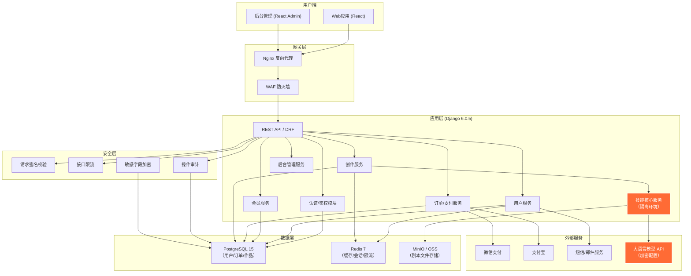
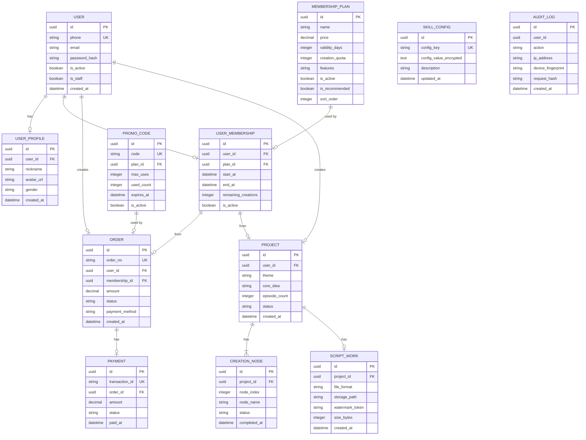
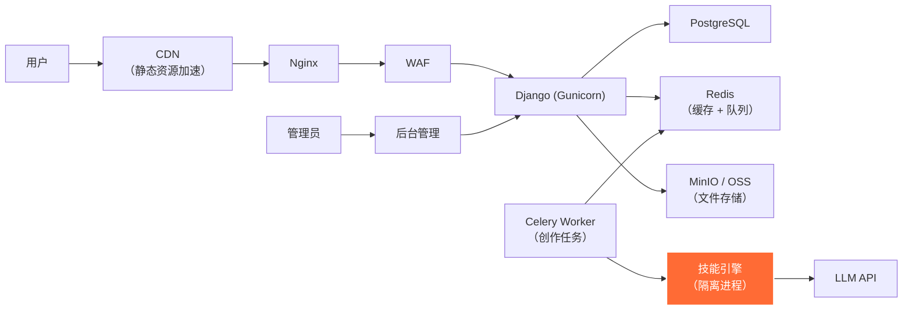

# 短剧剧本创作平台 技术架构文档

> **业务视角**（独立 Agent 主链路、Artifact 依赖、计费与交付）：见 [CREATION-BUSINESS-ARCHITECTURE.md](./CREATION-BUSINESS-ARCHITECTURE.md)。

---

## 1. 架构设计



---

## 2. 技术选型

### 2.1 前端

| 领域 | 技术栈 | 版本 | 说明 |
|------|--------|------|------|
| 核心框架 | React | 18.2.0 | 使用函数组件 + Hooks |
| 构建工具 | Vite | 5.x | 快速开发构建 |
| 路由 | react-router-dom | 6.x | 客户端路由 |
| 状态管理 | Zustand | 4.x | 轻量级全局状态 |
| UI 组件库 | Ant Design | 5.x | 后台管理使用 |
| 样式方案 | TailwindCSS | 3.x | 原子化CSS |
| 动画 | Framer Motion | 11.x | 流畅动画效果 |
| 图表 | Recharts / ECharts | - | 后台数据可视化 |
| HTTP 客户端 | Axios | 1.x | 封装请求拦截器 |
| 代码混淆 | terser + custom | - | 生产构建混淆 |

### 2.2 后端

| 领域 | 技术栈 | 版本 | 说明 |
|------|--------|------|------|
| 核心框架 | Django | 6.0.5 | 主框架 |
| REST 框架 | Django REST Framework | 3.15.x | API开发 |
| 数据库 | PostgreSQL | 15.x | 主数据库 |
| ORM | Django ORM | - | 数据库操作 |
| 缓存 | Redis + django-redis | 7.x | 缓存与会话 |
| 认证 | djangorestframework-simplejwt | 5.x | JWT Token |
| 任务队列 | Celery + Redis | 5.x | 异步创作任务 |
| 文件存储 | django-storages + MinIO | - | 对象存储 |
| 限流 | django-ratelimit | - | 接口限流 |
| 支付SDK | 微信支付/支付宝官方SDK | - | 支付集成 |

### 2.3 基础设施

| 领域 | 技术 | 说明 |
|------|------|------|
| Web 服务器 | Nginx 1.25 | 反向代理 + 静态文件 |
| 容器化 | Docker + Docker Compose | 部署方案 |
| 进程管理 | Gunicorn | WSGI服务器 |
| 异步任务 | Celery Beat | 定时任务 |
| 监控 | Prometheus + Grafana | 服务监控（可选） |
| 日志 | ELK Stack | 日志收集（可选） |

---

## 3. 项目结构

### 3.1 后端 (backend/)

```
backend/
├── config/                    # 项目配置
│   ├── settings/
│   │   ├── base.py           # 基础配置
│   │   ├── development.py    # 开发环境
│   │   ├── production.py     # 生产环境
│   │   └── secure.py         # 安全配置（加密存储）
│   ├── urls.py               # 主路由
│   └── wsgi.py               # WSGI入口
├── apps/                      # 应用模块
│   ├── users/                 # 用户模块
│   │   ├── models.py          # User, UserProfile
│   │   ├── serializers.py
│   │   ├── views.py
│   │   ├── urls.py
│   │   └── services.py
│   ├── membership/            # 会员模块
│   │   ├── models.py          # MembershipPlan, UserMembership, PromoCode
│   │   ├── serializers.py
│   │   ├── views.py
│   │   ├── urls.py
│   │   └── services.py
│   ├── orders/                # 订单模块
│   │   ├── models.py          # Order, Payment, Invoice
│   │   ├── serializers.py
│   │   ├── views.py
│   │   ├── urls.py
│   │   ├── services.py
│   │   └── pay/               # 支付适配器
│   ├── creation/              # 创作模块
│   │   ├── models.py          # Project, CreationNode, ScriptWork
│   │   ├── serializers.py
│   │   ├── views.py
│   │   ├── urls.py
│   │   ├── services.py
│   │   └── tasks.py           # Celery异步任务
│   ├── skill/                 # 技能核心模块（隔离）
│   │   ├── models.py          # SkillConfig, ThemeTemplate, HookLibrary
│   │   ├── serializers.py
│   │   ├── admin.py           # 仅后台访问
│   │   ├── services.py        # 核心逻辑（加密引用）
│   │   ├── engine/            # 7节点流水线引擎
│   │   │   ├── node1_input.py
│   │   │   ├── node2_structure.py
│   │   │   ├── node3_character.py
│   │   │   ├── node4_outline.py
│   │   │   ├── node5_script.py
│   │   │   ├── node6_review.py
│   │   │   └── node7_export.py
│   │   ├── templates/         # 加密存储的模板文件
│   │   └── references/        # 参考资料（加密存储）
│   ├── security/              # 安全模块
│   │   ├── middleware.py      # 签名校验/限流/审计中间件
│   │   ├── services.py        # 加密/签名/水印服务
│   │   ├── models.py          # AuditLog, RateLimitRecord
│   │   └── admin.py
│   ├── common/                # 公共模块
│   │   ├── pagination.py
│   │   ├── permissions.py
│   │   ├── exceptions.py
│   │   └── utils.py
│   └── admin_panel/           # 后台管理模块
│       ├── views.py
│       ├── urls.py
│       └── serializers.py
├── requirements.txt           # Python依赖
├── manage.py
└── .env.example
```

### 3.2 前端 (frontend/)

```
frontend/
├── public/
├── src/
│   ├── main.jsx               # 入口文件
│   ├── App.jsx                # 根组件
│   ├── router/                # 路由配置
│   │   ├── index.jsx
│   │   └── PrivateRoute.jsx   # 鉴权路由
│   ├── store/                 # 状态管理
│   │   ├── userStore.js       # 用户状态
│   │   └── memberStore.js     # 会员状态
│   ├── services/              # API服务
│   │   ├── request.js         # Axios封装 + 签名
│   │   ├── auth.js
│   │   ├── member.js
│   │   ├── creation.js
│   │   └── security/          # 签名/加密工具
│   │       ├── signature.js   # WebAssembly签名模块
│   │       └── obfuscator.js  # 代码混淆工具
│   ├── components/            # 公共组件
│   │   ├── layout/            # 布局组件
│   │   ├── ui/                # UI原子组件
│   │   └── common/            # 通用业务组件
│   ├── pages/                 # 页面
│   │   ├── Home/              # 首页
│   │   ├── Auth/              # 登录注册
│   │   ├── Member/            # 会员中心
│   │   ├── Creation/          # 创作页
│   │   ├── Works/             # 我的作品
│   │   ├── Profile/           # 个人中心
│   │   └── Admin/             # 后台管理
│   │       ├── Dashboard/
│   │       ├── UserManage/
│   │       ├── MemberManage/
│   │       ├── SkillConfig/   # 技能配置
│   │       ├── OrderManage/
│   │       └── SystemSetting/
│   ├── styles/                # 全局样式
│   ├── hooks/                 # 自定义Hooks
│   └── utils/                 # 工具函数
├── package.json
├── vite.config.js
└── tailwind.config.js
```

---

## 4. 路由定义

### 4.1 前端路由

| 路由路径 | 页面 | 权限 |
|---------|------|------|
| `/` | 首页 | 公开 |
| `/login` | 登录页 | 公开 |
| `/register` | 注册页 | 公开 |
| `/member` | 会员套餐页 | 登录用户 |
| `/member/orders` | 我的订单 | 登录用户 |
| `/member/card` | 卡密兑换 | 登录用户 |
| `/creation` | 创作页 | 登录+有效会员 |
| `/works` | 我的作品列表 | 登录用户 |
| `/works/:id` | 作品详情 | 登录用户（仅自己的作品） |
| `/profile` | 个人中心 | 登录用户 |
| `/profile/security` | 安全设置 | 登录用户 |
| `/share/:token` | 分享的作品 | 公开（带token访问） |
| `/admin` | 后台登录页 | 管理员 |
| `/admin/dashboard` | 仪表盘 | 管理员 |
| `/admin/users` | 用户管理 | 管理员 |
| `/admin/members/plans` | 套餐配置 | 管理员 |
| `/admin/members/cards` | 卡密管理 | 管理员 |
| `/admin/skill/config` | 技能配置 | 超级管理员 |
| `/admin/skill/templates` | 模板管理 | 超级管理员 |
| `/admin/orders` | 订单管理 | 管理员 |
| `/admin/statistics` | 数据统计 | 管理员 |
| `/admin/settings` | 系统设置 | 超级管理员 |

### 4.2 后端 API 路由

| 前缀 | 模块 | 说明 |
|-----|------|------|
| `/api/auth/` | 认证 | 登录/注册/登出/刷新Token |
| `/api/users/` | 用户 | 个人资料/安全设置 |
| `/api/members/` | 会员 | 套餐列表/我的会员/卡密兑换 |
| `/api/orders/` | 订单 | 创建订单/支付回调/订单列表/发票 |
| `/api/creation/` | 创作 | 提交创作/查询进度/获取结果 |
| `/api/works/` | 作品 | 作品列表/详情/下载/分享 |
| `/api/admin/` | 后台管理 | 所有管理功能（需管理员权限） |
| `/api/health/` | 健康检查 | 公开 |

---

## 5. API 定义（核心）

### 5.1 请求签名机制（安全核心）

**每个 API 请求必须包含以下 Header**:

| Header | 说明 |
|--------|------|
| `Authorization` | `Bearer {access_token}` |
| `X-Timestamp` | Unix 时间戳（秒），±5 分钟内有效 |
| `X-Nonce` | 16 位随机字符串，5分钟内防重放 |
| `X-Signature` | `HMAC-SHA256(secret, method + path + timestamp + nonce + body_hash)` |
| `X-Device-Fingerprint` | 设备指纹 |

### 5.2 创作接口（核心）

**POST** `/api/creation/submit` - 提交创作任务（返回预渲染结果，不返回原始数据结构）

```typescript
// 请求
interface CreationSubmitRequest {
  theme: string;           // 题材代码: family-revenge / overbearing-ceo ...
  coreIdea: string;        // 一句话核心创意
  episodeCount: number;    // 集数: 30-200
  episodeDuration?: number;// 单集时长（分钟）
  formatVariant?: 'A' | 'B' | 'C' | 'D';  // 输出格式变体，默认B
  audience?: string;       // 目标受众描述
  referenceWork?: string;  // 参考作品
}

// 响应：仅返回任务ID，不返回任何数据结构
interface CreationSubmitResponse {
  code: 0;
  message: "success";
  data: {
    taskId: string;         // 任务追踪ID
    estimatedMinutes: number;
  };
}
```

**GET** `/api/creation/progress/:taskId` - 查询创作进度

```typescript
// 响应：返回预渲染的HTML进度片段 + 状态
interface CreationProgressResponse {
  code: 0;
  message: "success";
  data: {
    status: 'pending' | 'running' | 'completed' | 'failed';
    currentNode: number;    // 当前节点 1-7
    totalNodes: number;
    progressPercent: number;
    // 预渲染的进度卡片 HTML 片段（前端直接插入，不解析）
    renderedProgressHtml: string;
    // 完成时返回：预渲染的结果页面HTML（仅前端展示用，加密水印）
    renderedResultHtml?: string;
    // 一次性下载token（仅15分钟有效）
    downloadToken?: string;
  };
}
```

**GET** `/api/creation/download/:downloadToken` - 下载剧本

- 返回二进制文件流（Markdown/HTML/ZIP）
- 文件含数字水印
- 不返回任何 JSON 元数据

### 5.3 其他核心接口

| Method | Path | 说明 |
|--------|------|------|
| POST | `/api/auth/login` | 登录 |
| POST | `/api/auth/register` | 注册 |
| POST | `/api/auth/refresh` | 刷新 Token |
| GET | `/api/users/profile` | 获取个人资料 |
| PUT | `/api/users/profile` | 更新个人资料 |
| GET | `/api/members/plans` | 获取会员套餐列表 |
| POST | `/api/members/card/redeem` | 卡密兑换 |
| POST | `/api/orders/create` | 创建订单 |
| GET | `/api/orders/list` | 我的订单列表 |
| GET | `/api/works/list` | 我的作品列表 |
| GET | `/api/works/:id` | 作品详情（返回预渲染HTML） |
| POST | `/api/works/:id/share` | 生成分享链接 |

---

## 6. 数据模型

### 6.1 ER 图



### 6.2 核心表说明

| 表名 | 关键安全设计 |
|------|-------------|
| `user` | `password_hash` 使用 PBKDF2+随机盐；手机号/邮箱加密存储 |
| `skill_config` | 所有配置值 `config_value_encrypted` 使用 AES-256 加密；仅后台可读 |
| `audit_log` | 完整记录用户IP、设备指纹、请求哈希；不可修改、不可删除 |
| `script_work` | `storage_path` 为加密路径；`watermark_token` 用于溯源 |

---

## 7. 技能引擎服务设计（核心安全区）

### 7.1 隔离设计

```
┌─────────────────────────────────────────────────────────┐
│                     技能核心服务（隔离）                  │
│  ┌───────────────────────────────────────────────────┐  │
│  │  skill/engine/ （Django App - 独立进程池）         │  │
│  │  - 不暴露任何 HTTP 接口                            │  │
│  │  - 仅通过内部消息队列（Redis Pub/Sub）通信          │  │
│  │  - 模板/参考资料存储在加密目录                      │  │
│  │  - LLM API Key 加密存储在环境变量                   │  │
│  └───────────────────────────────────────────────────┘  │
│                     ↑ 仅内部调用                         │
└─────────────────────────────────────────────────────────┘
                           │
                    Redis Pub/Sub
                           │
┌─────────────────────────────────────────────────────────┐
│                  创作服务（API层）                       │
│  - 接收用户创作请求                                      │
│  - 参数签名验证                                          │
│  - 会员权益检查                                          │
│  - 发送任务到技能引擎                                    │
│  - 轮询任务状态                                          │
│  - 将原始结果渲染为HTML片段                               │
│  - 不返回任何原始数据结构                                │
└─────────────────────────────────────────────────────────┘
```

### 7.2 技能后台配置

后台可配置的核心参数（`/admin/skill/config`）:

| 配置项 | 数据类型 | 加密 | 默认值 |
|--------|---------|------|--------|
| `llm.api_endpoint` | string | 是 | - |
| `llm.api_key` | string | 是 | - |
| `llm.temperature` | float | 否 | 0.7 |
| `llm.max_tokens` | integer | 否 | 4096 |
| `skill.version` | string | 否 | "3.5.0" |
| `skill.active_nodes` | JSON | 否 | [1,2,3,4,5,6,7] |
| `theme.family-revenge.params` | JSON | 否 | {...} |
| `theme.overbearing-ceo.params` | JSON | 否 | {...} |
| `hook.library.enabled` | JSON | 否 | [...] |
| `review.score_weights` | JSON | 否 | {...} |
| `export.format_B.template` | text | 是 | - |
| `security.watermark_secret` | string | 是 | - |
| `compliance.sensitive_words` | JSON | 否 | [...] |

---

## 8. 部署架构



---

## 9. 安全加固清单

### 9.1 前端加固

- [ ] 生产构建启用代码混淆（terser + terser-obfuscator）
- [ ] 签名算法在 WebAssembly 中执行，不暴露在 JS 源码
- [ ] 前端 API Key / Secret 全禁用，仅后端持有
- [ ] 所有展示用剧本数据通过后端预渲染为 HTML，前端不解析原始结构
- [ ] 下载接口返回二进制流，无 JSON 包装

### 9.2 后端加固

- [ ] 所有写操作接口校验请求签名
- [ ] 创作接口按用户级别限流（免费用户: 1次/天，VIP: 10次/小时）
- [ ] 技能配置字段加密存储，仅超级管理员可修改
- [ ] 操作审计日志表设置为 ONLY INSERT，无 UPDATE/DELETE 权限
- [ ] 敏感字段（手机号、邮箱）在数据库中加密存储
- [ ] 支付回调使用官方SDK + 异步通知双重校验

### 9.3 基础设施加固

- [ ] 数据库仅内网访问
- [ ] Redis 设置密码 + 内网访问
- [ ] 技能引擎所在节点独立安全组
- [ ] 定期备份 + 异地容灾
- [ ] WAF 启用 SQL 注入/XSS/CC 攻击防护
