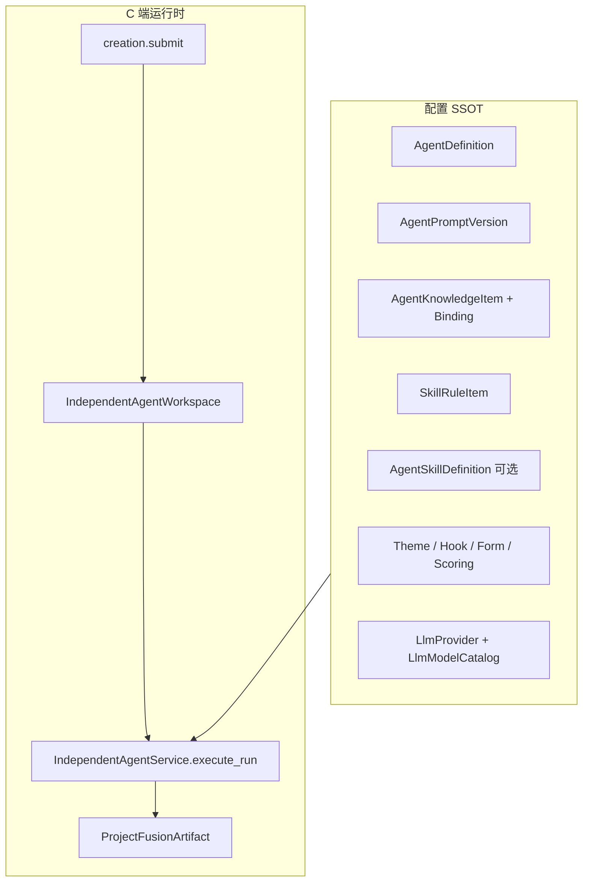

# Skill & Agent 总架构（Drama Skills v3.0）

> **状态（2026-06-22）**：已完成 Drama Skills 迁移。旧 brief/structure/character/outline/script 7节点主链已全面替换为 drama.* 36角色体系（8个职能部门，双轨创作模式）。
>
> 新系统入口：`backend/apps/drama/`（API）、`drama-skills/`（技能规范）、`frontend/src/pages/Drama/`（工作台UI）

---

## 1. 目标

- 统一「配置从哪里来、运行时怎么用、如何迭代」三条线，避免 Fusion 7 节点流水线与独立 Agent 双轨并存。
- 将 PDF 规划中的「大 JSON 拆原子表」收敛为：**规则用 `SkillRuleItem`，Agent 用 `AgentDefinition` + Knowledge，Catalog 逐步原子化**。
- 明确 SSOT 优先级，保证 Admin 改配置无需发版即可生效（在缓存 TTL 内）。

## 2. 范围

| 包含 | 不包含 |
|------|--------|
| 独立 Agent 工作台运行链路 | Fusion 自动 7 节点流水线（待删除，见 [02-LEGACY-REMOVAL-PLAN.md](./02-LEGACY-REMOVAL-PLAN.md)） |
| Skill 规则 / Catalog / LLM 配置 SSOT | 通用对话 Agent 20 步动态编排 / MCP 工具层 |
| Artifact 作为创作数据总线 | 会员/支付域细节（见 billing 模块） |

## 3. 架构总览



### 3.1 运行时 Prompt 公式

```
SystemPrompt = AgentPromptVersion.system_prompt
             + Knowledge 注入（按 binding + injection_policy）
             + SkillRuleLoader 渲染片段（经 Knowledge 绑定或全局 compliance 规则）

UserPrompt   = render(user_prompt_template, { project, artifacts, params, knowledge })
             + output_format_prompt + constraints_prompt + artifact_key 契约提示
```

代码入口：`backend/apps/creation/agent_runtime/independent_service.py` → `_prepare_prompt()` / `render_agent_prompt()`。

### 3.2 SSOT 优先级

1. **DB `status=active` 记录**（`SkillRuleItem`、`SkillRuleConfig`、`AgentPromptVersion.is_active` 等）
2. **Bootstrap / management 命令导入的 JSON**（首次 `ensure_defaults` / `import_*_to_db`）
3. **代码内常量**（仅作兜底，目标逐步迁入 DB，见 [20-MIGRATION-RUNBOOK.md](./20-MIGRATION-RUNBOOK.md)）

热加载：`SkillRuleLoader` 对磁盘 JSON 有 `_HOT_RELOAD_*` 缓存；生产环境应以 DB Item 为准。

## 4. 核心模型与职责

| 层级 | 模型 | 职责 |
|------|------|------|
| Runtime | `LlmProvider`, `LlmModelCatalog`, `LlmUsageLog` | 模型接入、计费追踪 |
| Agent 定义 | `AgentDefinition`, `AgentPromptVersion`, `AgentKnowledgeBinding` | C 端可运行 Agent 骨架 |
| Skill 定义 | `AgentSkillDefinition` | Cursor/工具侧 SKILL.md SSOT（可选挂接 Knowledge） |
| 规则 | `SkillRuleConfig`（包）+ `SkillRuleItem`（条） | Tier1–4 铁律/品类/合规 |
| Catalog | `ThemeTemplate`, `HookLibrary`, `DialogueTemplate`, `CreationFormOverrideConfig` 等 | 创作表单与题材素材 |
| 质量 | `SkillDefect`, `ReviewScoringConfig` | 缺陷闭环与评分预设 |
| 执行 | `AgentExecutionRun`, `ProjectFusionArtifact` | 运行审计与产物 |

数据分层详情：[10-DATA-LAYER-MAP.md](./10-DATA-LAYER-MAP.md)。

## 5. 服务接口（C 端）

前缀 `/api/creation/`（见 `backend/apps/portal/creation/urls.py`）：

| 方法 | 路径 | 说明 |
|------|------|------|
| POST | `submit/` | 创建 Project + `project_brief` |
| GET | `projects/<id>/workspace/` | Agent 列表、依赖、can_run |
| POST | `projects/<id>/agents/<agent_id>/estimate/` | Token 预估 |
| POST | `projects/<id>/agents/<agent_id>/run/` | 入队 `run_independent_agent` |
| GET | `projects/<id>/agent-notes/` | 项目 Agent 记忆 |
| PATCH | `projects/<id>/agent-notes/` | 更新记忆 |
| POST | `projects/<id>/agents/<agent_id>/stream/` | SSE 流式生成 |
| GET | `projects/<id>/chunks/` | 分片列表 |
| POST | `projects/<id>/chunks/continue/` | 断点续生 |

响应格式遵循项目统一 `{ code, message, data }`（Portal 层）。

## 6. Admin / 运维

- Agent：`AgentHubPage`、Prompt/Knowledge/Route 面板
- 规则：`SkillRulesPanel` + Console `rule_item_views`
- Skill 中心：`SkillCenterPage` / `AgentSkillDefinition`

操作 SOP：[21-ADMIN-OPERATIONS-GUIDE.md](./21-ADMIN-OPERATIONS-GUIDE.md)。

## 7. 迁移与初始化

标准顺序见 [20-MIGRATION-RUNBOOK.md](./20-MIGRATION-RUNBOOK.md)。新环境最低要求：

```bash
python manage.py init_skill_data
python manage.py import_skill_rules_to_db
# flatten SkillRuleItem（Console API 或 rule_item_service.flatten_from_configs）
python manage.py import_skills_to_db
# Agent 默认定义
python manage.py seed_independent_agents  # 或 AgentDefinitionService.ensure_defaults()
```

## 8. 测试矩阵（总纲级）

| 场景 | 验收 |
|------|------|
| 正常 | submit → workspace → run → artifact 写入 |
| 边界 | 缺 required_artifact 时 `can_run=false` |
| 异常 | LLM 返回非 JSON → 见 [31-JSON-SELF-HEAL-SPEC.md](./31-JSON-SELF-HEAL-SPEC.md) |
| 权限 | 非项目 owner 调用 run 返回 403 |

## 9. 与旧逻辑删除清单

本总纲 **不维护** Fusion 主路径。待删/已删索引：[02-LEGACY-REMOVAL-PLAN.md](./02-LEGACY-REMOVAL-PLAN.md)。

## 10. 相关文档索引

| 文档 | 内容 |
|------|------|
| [01-AGENT-SKILL-USER-LAYERS.md](./01-AGENT-SKILL-USER-LAYERS.md) | Agent / Skill / User 三层边界 |
| [11-SKILL-RULE-ITEM-SPEC.md](./11-SKILL-RULE-ITEM-SPEC.md) | 规则原子化 |
| [30-INDEPENDENT-AGENT-RUNTIME.md](./30-INDEPENDENT-AGENT-RUNTIME.md) | 运行链路 |
| [40-STREAMING-GENERATION-SPEC.md](./40-STREAMING-GENERATION-SPEC.md) | 大数组产物流式生成 |
