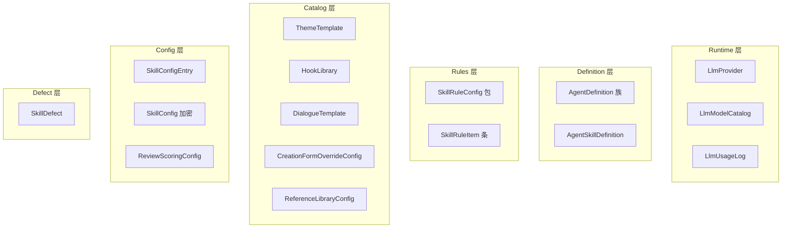

# 数据分层映射（Skill SSOT）

---

## 1. 目标

列出 Skill/Agent 相关表的职责、读写入口与缓存策略；明确 **Tier 原子表统一为 `SkillRuleItem`**，不新增 PDF 中的 `Tier1WritingProhibition` 等独立 Model。

## 2. 分层架构



## 3. 表清单

| 表 | db_table | 原子化 | 读入口 | 写入口 |
|----|----------|--------|--------|--------|
| `LlmProvider` | skill_llm_provider | 否 | `LlmService` | Admin / setup 命令 |
| `LlmModelCatalog` | skill_llm_model_catalog | 否 | Provider.catalog FK | sync 命令 |
| `LlmUsageLog` | skill_llm_usage_log | 行级 | 监控/计费 | chat 后写入 |
| `AgentDefinition` | agent_definition | 否 | `AgentDefinitionService` | Admin / seed |
| `AgentPromptVersion` | agent_prompt_version | 否 | `active_prompt()` | Admin |
| `AgentKnowledgeItem` | agent_knowledge_item | 可 | `load_knowledge()` | Admin / import |
| `AgentSkillDefinition` | agent_skill_definition | 否（content 大文本） | Console API | import_skills_to_db |
| `SkillRuleConfig` | skill_rule_config | 否（content JSON） | Loader 兜底 | import_skill_rules_to_db |
| **`SkillRuleItem`** | skill_rule_item | **是** | `SkillRuleLoader._items_for_prompt` | flatten / Admin |
| AgentSkillSection | skill_agent_skill_section | **是** | Section API / sync | Admin Section Inline |
| CreationPlatform 等 7 表 | skill_creation_* | **是** | `CreationFormOverrideService` 双读 | `migrate_creation_form_atomic` |
| ReviewScoringPreset 三表 | agent_review_scoring_* | **是** | `ReviewScoringService.resolve` | `migrate_review_scoring_atomic` |
| `ThemeTemplate` | theme_template | 部分（params JSON） | creation form | init_skill_data |
| `HookLibrary` | hook_library | **是** | 创作推荐 | Admin |
| `DialogueTemplate` | dialogue_template | **是** | 润色/对话 | Admin |
| `CreationFormOverrideConfig` | creation_form_override | 否 | Portal 表单 | import_configs_to_db |
| `SkillConfigEntry` | skill_config_entry | 按 key | `/api/configs/` | migrate_hardcoded |
| `SkillConfig` | skill_config | KV | 加密读取 | Admin |
| `ReviewScoringConfig` | review_scoring_config | 否 | 审查 Agent | defaults |
| `SkillDefect` | skill_defect | 是 | 质量闭环 | Admin |

模型文件：`backend/apps/skill/models.py`、`backend/apps/agent/models.py`。

## 4. 加载优先级（Rules）

```
SkillRuleItem (active, item_type=rule)
    ↓ 无 Item 时
SkillRuleConfig (active, 按 tier/scope 过滤)
    ↓ 无 DB 时
磁盘 skill-rules/*.json（热加载缓存，开发兜底）
```

实现：`backend/apps/skill/skills/loader.py`。

## 5. 缓存策略

| 数据 | 策略 |
|------|------|
| SkillRuleItem | 无进程内永久缓存；依赖 DB 索引 |
| SkillRuleConfig tier_full | `_PERMANENT_CACHE` 可选 |
| 磁盘 JSON | `_HOT_RELOAD_MTIME` |
| AgentDefinition | `AgentDefinitionService` 请求级查询 |

生产变更 Item 后：无需重启；Loader 下次 run 即读新 active 行。

## 6. 与 PDF 40+ 原子表方案差异

| PDF 方案 | 本项目 |
|----------|--------|
| `Tier1WritingProhibition` 等 40+ 表 | 统一 `SkillRuleItem` + `payload` JSON |
| `ThemeActRatio` 等 6 张子表 | 已实现 + `migrate_theme_atomic` |
| `CreationPlatform` 等 7 张子表 | 已实现 + `migrate_creation_form_atomic` |
| `ReviewScoringPreset` 三表 | 已实现 + `migrate_review_scoring_atomic` |
| `AgentSkillSection` 表 | **已实现**；见 [12-AGENT-SKILL-DEFINITION-SPEC.md](./12-AGENT-SKILL-DEFINITION-SPEC.md) |

## 7. 测试矩阵

| 类型 | 验收 |
|------|------|
| normal | Item active 时 loader 返回 `[rule_key]\nbody` |
| boundary | genre 过滤 Tier2 仅命中 scope_key |
| error | Item 表空时 fallback Config 不抛裸异常 |
| permission | Console rule_item API 需 staff |

## 8. 旧逻辑删除

- 运行时不再以 `tier1-iron-rules.json` 为 SSOT（仅 import 源）
- 删除 Fusion 专用 `build_full_system_prompt(node_id=…)` 主链调用

参考：[02-LEGACY-REMOVAL-PLAN.md](./02-LEGACY-REMOVAL-PLAN.md)。
