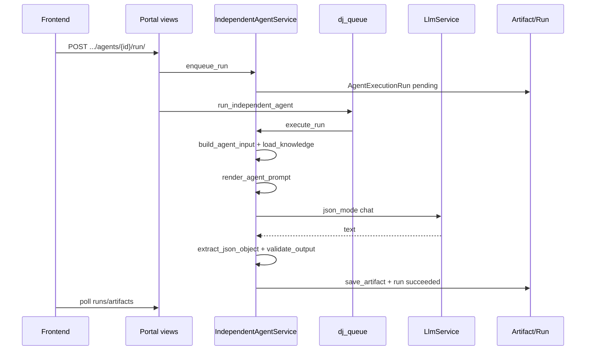

# 独立 Agent 运行时规范

---

## 1. 目标

描述 C 端从 `run` 到 Artifact 落库的完整链路，作为实施与排障 SSOT。

## 2. 调用链

核心文件：

- `backend/apps/creation/agent_runtime/independent_service.py`
- `backend/apps/agent/definition_service.py`
- `backend/apps/creation/artifact_service.py`
- `backend/apps/creation/monitoring/execution_run_service.py`

## 3. 入参构建

`build_agent_input(project, agent, params)`：

| 来源 | 字段 |
|------|------|
| `input_contract.project_fields` | theme, episode_count 等 |
| `required_artifacts` | 缺失则 `AgentRuntimeError` |
| `optional_artifacts` | 有则注入 |
| `params` | 前端 run 参数（集数范围等） |
| 素材库 | `_attach_reference_materials()` 最多 5 条 injection |

## 4. Knowledge 注入

`load_knowledge(agent, project)` 步骤：

1. 合并 `knowledge_injection_policy`（excluded_categories, category_caps, max_total_chars）
2. 遍历 `AgentDefinitionService.enabled_bindings(agent)`
3. 跳过 VALIDATOR / OUTPUT_SCHEMA / inject_position=validator
4. `_knowledge_matches_project()` — theme/platform 白名单
5. 去重 (category, title)；按 cap 截断；总字符预算

默认策略：`DEFAULT_INJECTION_POLICY` — schema/validator 不注入 prompt。

## 5. Prompt 渲染

`render_agent_prompt()`：

- **System**：`AgentPromptVersion.system_prompt`（纯文本，不在此拼接 Tier 大段 — Tier 应进 Knowledge）
- **User**：模板渲染 + `output_format_prompt` + `constraints_prompt` + `_artifact_key_hint()`

模板语法：`{{ project.theme }}`、`{{ artifacts.episode_scripts }}` — 见 `TEMPLATE_PATH_VAR_RE`.

## 6. LLM 与校验

1. `AgentDefinitionService.active_route(agent)` → provider/model/max_tokens
2. `LlmService.chat(..., json_mode=True)`
3. `extract_json_object()` — 支持 fenced JSON、strict=False 兜底
4. `validate_output()` — artifact_key 契约 + `output_schema_validation`
5. 集数产物：`merge_episodes_by_number()`（`episode_scripts`, `series_outline`）

## 7. AgentExecutionRun 字段

| 字段 | 用途 |
|------|------|
| status | pending/running/succeeded/failed |
| prompt_version | 审计 |
| input_snapshot | 脱敏输入 |
| output_artifact_keys | 写入产物 |
| token 估算 / provider / model | 成本 |
| error_message | 失败原因 |

Portal 默认 `include_sensitive=False` 隐藏完整 prompt。

## 8. 并发与超时

- 同项目 `running_run()`：30 分钟超时自动 failed
- 新 run 前检查是否已有 running（enqueue 层）

## 9. 与 SkillRuleLoader 集成

`IndependentAgentService._prepare_prompt()` 内调用 `SkillRuleLoader.build_agent_rules_snippet(agent_id, genre=project.theme)`，append 到 system/knowledge 块。Tier3 scope 映射见 `apps/skill/skills/agent_scope.py`。

## 10. 测试矩阵

| 类型 | 文件/场景 |
|------|-----------|
| normal | `test_independent_agent_runtime.py` run 成功写 artifact |
| boundary | preview 超 max_prompt_tokens |
| error | 缺 required artifact → can_run false |
| permission | `assert_project_owner` 403 |

## 11. JSON 自修复

见 [31-JSON-SELF-HEAL-SPEC.md](./31-JSON-SELF-HEAL-SPEC.md) — 在 `extract_json_object` 失败后插入。

## 12. 旧逻辑删除

- `SkillInvoker.invoke(skill_id=creation.*)` 作为主链
- FusionCliRunner 子技能 trace（独立 Agent 默认无 sub_skills）

参考：[02-LEGACY-REMOVAL-PLAN.md](./02-LEGACY-REMOVAL-PLAN.md)。
